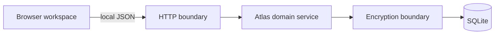

# Architecture

One Node.js process serves the dependency-free browser client, exposes a local
JSON API, applies domain rules, and stores encrypted payloads in SQLite.

## Boundaries

- `public/` owns rendering, interaction, accessible dialogs, and client-side
  guidance. It is not trusted to enforce integrity.
- `src/server.js` owns loopback HTTP, static files, bounded byte-buffered JSON
  parsing, and stable error responses. It contains no category policy.
- The domain service owns validation, optimistic revisions, goal ordering,
  links, search, trash, history, and atomic transfer.
- The encryption collaborator owns key derivation and authenticated payload
  envelopes. Decrypted content never enters SQL queries or logs.
- The database layer owns numbered migrations, constraints, transactions, WAL,
  and test database injection.

The browser's JSON API is an application interface, not an agent contract.
There are no agent discovery, tool catalog, OpenAPI, MCP, or autonomous write
surfaces in v1.

## Reads and search

SQLite narrows records by clear structural fields such as category and trash
state. The local process decrypts candidates and performs text matching over
titles, summaries, narratives, tags, and custom values. This favors privacy
and a small implementation over a plaintext full-text index.

## Transfer

Export serializes the complete logical state—including history and trash—then
encrypts it with a separately derived backup key. Import decrypts and validates
the complete snapshot before beginning one replacement transaction. A failed
decrypt, validation, or write leaves the existing atlas unchanged.
