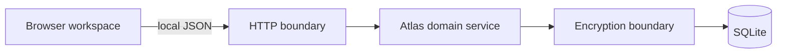

# Architecture

One Node.js process serves the dependency-free browser client, exposes a local
JSON API, applies domain rules, and stores encrypted payloads in SQLite.

The browser routes Experience, Goal, Project, Resource, and Relationship
details to full-page views; Person and Preference details remain drawer views.

## Boundaries

- `public/` owns rendering, interaction, accessible dialogs, and client-side
  guidance. It is not trusted to enforce integrity.
- `src/server.js` owns loopback HTTP, static files, bounded byte-buffered JSON
  parsing, and stable error responses. It contains no category policy.
- The domain service owns validation, optimistic revisions, goal ordering,
  acyclic sibling prerequisites, recursive progress roll-up, links, search,
  trash, history, and atomic transfer.
- The encryption collaborator owns key derivation and authenticated payload
  envelopes. Decrypted content never enters SQL queries or logs.
- The database layer owns numbered migrations, constraints, transactions, WAL,
  and test database injection.
- Experience images are stored as encrypted binary attachments. The database
  keeps only attachment association, count, timestamps, and approximate size in
  clear structural columns; attachment changes do not participate in record
  revisions, and attachments survive trash.

Knowledge uses the same domain, lock, encryption, migration, and backup
boundaries as the other workspaces. Structural Knowledge metadata remains
queryable in SQLite; names, explanations, and terms stay inside encrypted
payloads. The browser contract is namespaced under `/api/knowledge`.

Atlas exposes one native loopback API to its browser and trusted local
integrations. Except for status, setup, and unlock, operations require the
process-wide Atlas state to be unlocked. Mutating browser requests enforce the
loopback same-origin boundary; native clients do not use a separate credential.
One process owns a database through an atomic lease acquired before database or
import-staging cleanup. Setup, unlock, reset, and import replacement are
serialized, and lock invalidates any asynchronous transition that began under
an earlier lifecycle generation.

The unlocked Settings page reads the server-owned complete OpenAPI document
for every implemented `/api/*` operation through
`/api/settings/api-reference`. The payload also retains the narrower
Knowledge-only document for contract consumers. Settings also owns navigation
into Recently removed.

## Reads and search

SQLite narrows records by clear structural fields such as category and trash
state. The local process decrypts candidates and performs text matching over
titles, summaries, narratives, tags, and custom values. This favors privacy
and a small implementation over a plaintext full-text index.

## Transfer

Export serializes the complete logical state—including history and trash—and
streams attachment bytes through a separately derived backup key. Import
decrypts and validates the complete snapshot before beginning one replacement
transaction. A failed decrypt, validation, or write leaves the existing atlas
unchanged.

Backup v3 is a framed streamed `.atlas` format. Records, revisions, fields,
links, Knowledge entries, image metadata, and image bytes are processed as
separate authenticated-stream frames rather than one size-limited manifest.
Import uses encrypted staging, never decrypted temporary image files, and
atomically replaces the atlas after complete authentication and validation.
Legacy v1 JSON envelopes and v2 binary backups remain import-compatible.
